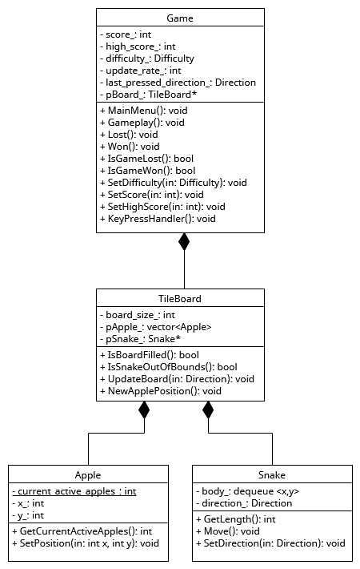
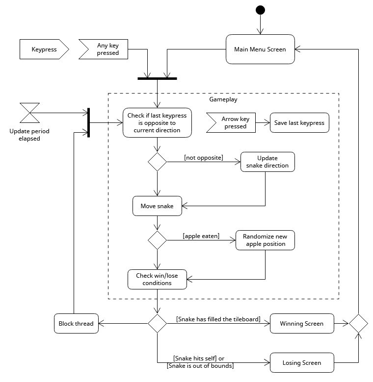

# Snake: a project for practicing TDD and Qt
The aim of this project is to recreate the classic
[Snake game](https://en.wikipedia.org/wiki/Snake_(video_game_genre)), using Test-Driven Development (TDD)
and graphic display creation using Qt. The development process will begin with the implementation and
testing of the game logic before moving on to the display.

## Test-Driven Development
The basis for the tests came from the [GoogleTest User's Guide](https://google.github.io/googletest/)
and the documentation on [Testing tools in Visual Studio](https://learn.microsoft.com/en-us/visualstudio/test/?view=visualstudio).
## Qt Graphic Display

## Modeling
Before the start of development some diagrams were created to guide the logic of the game and code structure. 
The diagrams shown will be updated to reflect changes made during the development phase.
### UML class diagram

### UML activity diagram

